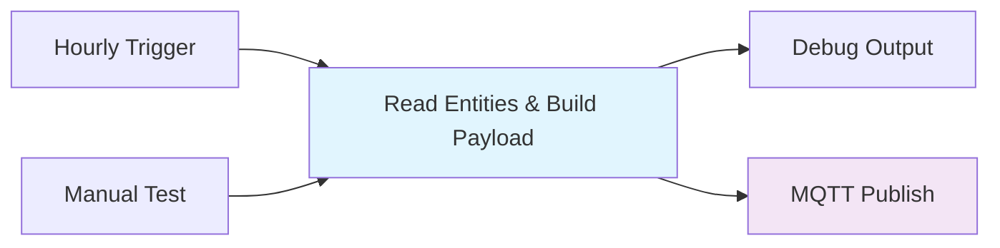

# Node-RED Moisture Sensor Monitoring for Home Assistant

**Simple, no-config-file approach** that reads your Home Assistant sensor entities and publishes clean MQTT data.

## Features

- ✅ **No config files required** - Edit entities directly in the workflow
- ✅ **Automatic name sanitization** - `sensor.dracanea_reflexa_3` → `Dracanea Reflexa`
- ✅ **Your exact entities** - Uses your sensor.dracanea_reflexa_3, sensor.dracanea_fragans_3, sensor.ficus_lyrata_3
- ✅ **Hourly scheduling** - Automatic trigger every hour
- ✅ **Manual testing** - Click to test immediately
- ✅ **Mock data fallback** - Works even if entities aren't available
- ✅ **Clean JSON output** - Exact format you requested

## Your Sensor Entities

The workflow is pre-configured for your sensors:
- `sensor.dracanea_reflexa_3` → **Dracanea Reflexa**
- `sensor.dracanea_fragans_3` → **Dracanea Fragans** 
- `sensor.ficus_lyrata_3` → **Ficus Lyrata**

## Quick Start

### 1. Import the Workflow
1. Open Home Assistant → Settings → Add-ons → Node-RED → Open Web UI
2. Click hamburger menu (☰) → Import → Select a file to import
3. Choose: `moisture-sensor-workflow.json`
4. Click Import → Deploy

### 2. Test It
1. Click the **Manual Test** inject button
2. Check the Debug sidebar for output
3. Monitor MQTT topic `iot/plants/moisture` in HA

### 3. Customize (Optional)
To add/remove/change sensors, edit the function node:
```javascript
var sensorEntities = [
    "sensor.dracanea_reflexa_3",
    "sensor.dracanea_fragans_3", 
    "sensor.ficus_lyrata_3",
    // Add more sensors here
];
```

## Expected Output

```json
{
  "updateDate": "2025-10-04 05:45",
  "plants": [
    { "name": "Dracanea Reflexa", "moisture": 67 },
    { "name": "Dracanea Fragans", "moisture": 43 },
    { "name": "Ficus Lyrata", "moisture": 89 }
  ]
}
```

## Name Sanitization Logic

The workflow automatically converts entity IDs to clean plant names:

| Entity ID | Becomes |
|-----------|---------|
| `sensor.dracanea_reflexa_3` | Dracanea Reflexa |
| `sensor.dracanea_fragans_3` | Dracanea Fragans |
| `sensor.ficus_lyrata_3` | Ficus Lyrata |
| `sensor.snake_plant_2` | Snake Plant |
| `sensor.peace_lily_1` | Peace Lily |

**Process:**
1. Remove `sensor.` prefix
2. Remove trailing `_3` (or any `_` + numbers)
3. Replace `_` with spaces
4. Capitalize each word

## Files in This Project

```
/home/jescarri/workspace/iot/e-paper/node-red/
├── moisture-sensor-workflow.json    # Node-RED workflow
└── README.md                        # This documentation
```

## Home Assistant Integration

Add these sensors to your `configuration.yaml`:

```yaml
mqtt:
  sensor:
    - name: "Dracanea Reflexa Moisture"
      state_topic: "iot/plants/moisture"
      value_template: "{{ value_json.plants | selectattr('name', 'equalto', 'Dracanea Reflexa') | map(attribute='moisture') | first | default('unknown') }}"
      unit_of_measurement: "%"
      device_class: "humidity"
      
    - name: "Dracanea Fragans Moisture"  
      state_topic: "iot/plants/moisture"
      value_template: "{{ value_json.plants | selectattr('name', 'equalto', 'Dracanea Fragans') | map(attribute='moisture') | first | default('unknown') }}"
      unit_of_measurement: "%"
      device_class: "humidity"
      
    - name: "Ficus Lyrata Moisture"
      state_topic: "iot/plants/moisture" 
      value_template: "{{ value_json.plants | selectattr('name', 'equalto', 'Ficus Lyrata') | map(attribute='moisture') | first | default('unknown') }}"
      unit_of_measurement: "%"
      device_class: "humidity"
```

Then restart Home Assistant to load the new sensors.

## Troubleshooting

### No data from entities
- Check that your sensor entities exist and have values
- The workflow will use mock data (20-100%) if entities aren't available
- Look at the debug output for warnings about missing entities

### MQTT not working
- Verify MQTT integration is enabled in Home Assistant
- Test MQTT with: Settings → Devices & Services → MQTT → Listen to topic: `iot/plants/moisture`
- Check that the MQTT broker is set to `core-mosquitto` in the workflow

### Wrong plant names
- Edit the function node to change the entity list
- The sanitization logic can be modified in the same function

### Change schedule
- Double-click "Hourly Trigger" inject node
- Change repeat interval (3600 = 1 hour)

## Architecture



**Simple 4-node workflow:**
1. **Triggers** - Hourly automatic + manual test
2. **Function** - Read HA entities, sanitize names, build JSON
3. **Debug** - Monitor output
4. **MQTT** - Publish to `iot/plants/moisture`

## Why This Approach?

✅ **No config files** - Everything in one place  
✅ **No file uploads** - Works entirely within Node-RED  
✅ **Easy to modify** - Just edit the entity list  
✅ **Clean and simple** - Only 4 nodes total  
✅ **Robust** - Falls back to mock data if needed